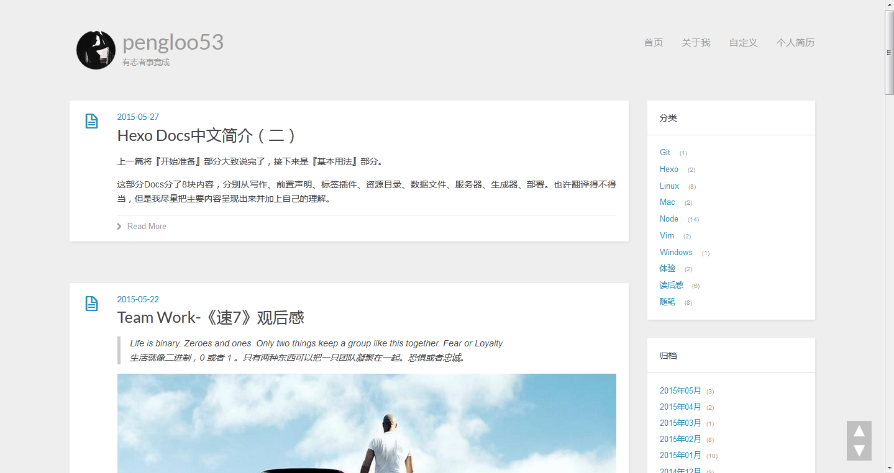
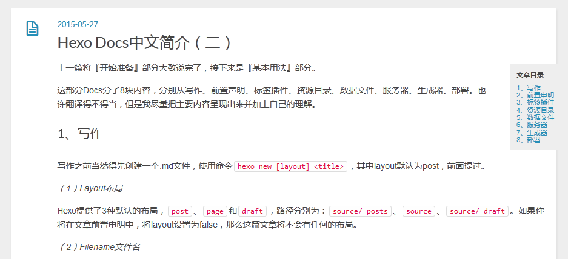

# light-ch（Hexo主题）

> 该主题是基于hexo默认主题[hexo-theme-light](https://github.com/hexojs/hexo-theme-light)的一个china适用版。

[Demo](http://www.linux2me.com)




##改造点

1. 去google服务、去facebook、去addthis等严重影响访问速度的服务，替换成百度分享、多说评论、百度统计等国内服务。
2. 修改code、blockquote样式（不太适合中文）。
3. 调整index布局文件。

##添加的新功能

1. Header添加头像，并添加增大动画效果
2. 添加新浪微博widgets
2. 添加归档widgets
3. 添加toTop（回到顶部）功能
4. 添加toc（文章目录）功能
5. 添加个人简历Layout（便于设计自己的页面）


## 安装

执行下面命令，然后修改`_config.yml`配置文件中`theme`为 `light-ch`.

```
git clone https://github.com/pengloo53/light-ch themes/light-ch
```

## 更新主题

```
cd themes/light-ch
git pull
```

## 配置

默认:

``` yaml
menu:
  首页: /
  # 归档: /archives
  # 关于我: /about
  自定义: /customization
  个人简历: /resume

widgets:
# - search
- category
- archive
# - tag
- tagcloud
- weibo

excerpt_link: Read More
avatar: /assets/img/avatar/avatar.jpg
baidu_share: true

# 请到baidu_tongji.ejs中替换代码
baidu_tongji: true

rss:

# enable是否开启；height小挂件高度；url替换成自己的微博挂件地址
weibo:
  enable: true
  height: 660
  url: Your url

# 评论提供可以选择 duoshuo 或者 wumii，无需评论，此处不填就行。
comment_provider: duoshuo

duoshuo:
  short_name: pengloo53

wumii: 
  relateditems: false
  siteprefix: http://www.linux2me.com
```

- `avatar` 头像URL
- `baidu_share` 百度分享
- `weibo` 新浪微博
- `duoshuo` 多说评论
- `wumii` 无觅关联

## Features

### Gallery Post


```
---
layout: photo
title: Gallery Post
photos:
- http://i.minus.com/ibobbTlfxZgITW.jpg
- http://i.minus.com/iedpg90Y0exFS.jpg
---
```

### Link Post


```
---
layout: link
title: Link Post
link: http://www.google.com/
---
```

### Tweet Widget


### Fancybox


[Hexo]: http://zespia.tw/hexo/
[AddThis]: https://www.addthis.com
[Fancybox]: http://fancyapps.com/fancybox/
